# PRD: MagiStock – A Multi-Agent, Persona-Aware Investment Companion


> Built on [AgentField.ai](https://agentfield.ai) — Guided Autonomy for Investment Decisions

## 1. Problem Statement

Retail investors struggle not because of lack of information, but because of:
- Misalignment between **investment strategies and personal risk tolerance**
- Overconfidence in a single market view
- Emotional decision-making during volatile market regimes

Most trading tools optimize for **maximum returns**, ignoring:
- Drawdowns
- Emotional sustainability
- Whether a strategy is suitable *for the user*

As a result, users often abandon good strategies at the worst possible time.

---

## 2. Proposed Solution

**MagiStock** is a persona-aware, multi-agent investment decision system built on the **AgentField** framework.

Inspired by the "Three Magi" archetype, the system consists of:
- Three competing **strategy agents** with distinct risk personalities — each composed of **Reasoners** (AI judgment) and **Skills** (deterministic execution)
- A **Judge agent** that selects the most suitable strategy based on the **user persona**, not just performance
- **Shared Memory** that flows context between agents automatically — no message queues, no manual wiring
- **Discovery** via AgentField's Control Plane — agents call each other by name

This follows the **Guided Autonomy** principle: agents reason freely within boundaries you define.

> *Predictable enough to trust. Flexible enough to be useful.*

Users can also **cultivate** an investment agent over time — similar to a Tamagotchi — aligning it progressively with their behavior and preferences.

---

## 3. Architecture: Mapping to AgentField Primitives

MagiStock maps cleanly to AgentField's four primitives:

| Primitive | Role in MagiStock | Analogy |
|-----------|-------------------|---------|
| **Reasoners** | Strategy critique, Judge decision, persona analysis | The decision-makers |
| **Skills** | Backtesting, metric calculation, indicator computation | The executors |
| **Memory** | User persona, backtest results, agent cultivation state | Shared context |
| **Discovery** | Judge finds strategy agents, agents find each other | Service mesh |

### Design Pattern: Coordination + Previously Impossible

MagiStock combines two AgentField patterns:

- **Coordination** — Three strategy agents explore in parallel, share findings via Memory, Judge synthesizes a recommendation
- **Previously Impossible** — Each strategy agent *reasons* about market conditions rather than following static rules. The Judge performs synthetic judgment that weighs persona alignment — something a lookup table could never do

---

## 4. System Overview

### 4.1 Core Agents

Each agent is an AgentField agent containing **Reasoners** (AI judgment calls) and **Skills** (deterministic functions).

#### 🔥 Fire Agent (Aggressive / High Risk)

| Component | Type | What it does |
|-----------|------|-------------|
| `run_momentum_backtest` | Skill | Executes momentum strategy on historical data |
| `calculate_metrics` | Skill | Computes return, drawdown, volatility |
| `critique_fire_strategy` | Reasoner | Evaluates whether aggressive approach suits the current market regime |

- Focus: Momentum, volatility, asymmetric upside
- Objective: Maximize returns
- Accepts high drawdowns
- Performs best in trending or speculative markets

#### 💧 Water Agent (Conservative / Low Risk)

| Component | Type | What it does |
|-----------|------|-------------|
| `run_conservative_backtest` | Skill | Executes capital-preservation strategy |
| `calculate_metrics` | Skill | Computes return, drawdown, volatility |
| `critique_water_strategy` | Reasoner | Evaluates whether conservative approach is appropriate |

- Focus: Capital preservation, stability
- Objective: Minimize drawdown and volatility
- Performs best in sideways or uncertain markets

#### 🌱 Grass Agent (Hybrid / Medium Risk)

| Component | Type | What it does |
|-----------|------|-------------|
| `run_adaptive_backtest` | Skill | Executes regime-switching strategy |
| `detect_market_regime` | Reasoner | Identifies current market conditions (trending/mean-reverting/volatile) |
| `calculate_metrics` | Skill | Computes return, drawdown, volatility |
| `critique_grass_strategy` | Reasoner | Evaluates adaptive performance and regime detection accuracy |

- Focus: Adaptive strategy selection
- Objective: Balance risk and reward
- Adjusts behavior based on detected market regime

---

### 4.2 Reasoner vs Skill Separation

This is the critical design decision in AgentField: **AI decides WHAT to do. Skills DO it.**

```
┌─────────────────────────────┐     ┌──────────────────────────────┐
│         REASONERS           │     │           SKILLS             │
│    (AI judgment calls)      │     │   (deterministic functions)  │
├─────────────────────────────┤     ├──────────────────────────────┤
│ • Strategy critique         │     │ • Backtest execution         │
│ • Market regime detection   │     │ • Metric calculation         │
│ • Judge persona matching    │     │ • Technical indicator math   │
│ • Risk alignment scoring    │     │ • Data fetching & formatting │
│ • Explanation generation    │     │ • Portfolio math             │
└─────────────────────────────┘     └──────────────────────────────┘
        Weighs tradeoffs               Same input → same output
        Interprets context              Easy to test, easy to mock
        Typed Pydantic output           No AI, no surprises
```

---

### 4.3 Backtesting & Self-Evaluation

Each agent follows this flow:

1. **Skill**: Execute strategy on historical market data (deterministic)
2. **Skill**: Calculate performance metrics (total return, max drawdown, volatility)
3. **Reasoner**: Critique own performance — AI weighs tradeoffs:
   - Market regime suitability
   - Risk alignment
   - Failure conditions
4. **Memory**: Store results to shared memory for the Judge to retrieve

This prevents blind confidence and enables informed arbitration.

---

### 4.4 Judge Agent (Persona-Aware Arbiter)

The Judge is the **synthesis** agent in the Coordination pattern:

| Component | Type | What it does |
|-----------|------|-------------|
| `select_strategy` | Reasoner | Weighs all agent outputs against user persona — the core judgment call |
| `explain_decision` | Reasoner | Generates human-readable explanation of why this strategy was chosen |
| `format_recommendation` | Skill | Structures the final output into a typed response |

The Judge:
- Retrieves all strategy outputs from **Shared Memory** (no hardcoded wiring)
- Retrieves the **user persona** from session memory
- Evaluates strategies against:
  - Risk tolerance
  - Investment horizon
  - Emotional sensitivity to losses
- Selects the most appropriate strategy, even if it does not have the highest return

This shifts the system from *"best strategy"* to *"best strategy for you"*.

---

## 5. Memory Architecture

AgentField Memory eliminates the need for Redis, Postgres config, or message queues. MagiStock uses three memory scopes:

| Scope | What's Stored | Example |
|-------|--------------|---------|
| **Session** | User persona for current interaction | `user_persona: {risk: "low", horizon: "long", drawdown_sensitivity: "high"}` |
| **Run** | Backtest results, strategy critiques from current execution | `fire_output: {return: 0.32, drawdown: -0.18, critique: "..."}` |
| **Agent** | Cultivation state, historical user preferences | `cultivation_level: 3, preference_history: [...]` |

### How Memory Flows

```
Fire Agent stores findings    →  app.memory.set("fire_result", result)
Water Agent stores findings   →  app.memory.set("water_result", result)
Grass Agent stores findings   →  app.memory.set("grass_result", result)

Judge Agent retrieves all     →  fire = app.memory.get("fire_result")
                                 water = app.memory.get("water_result")
                                 grass = app.memory.get("grass_result")

They never knew about each other. Memory just works.
```

---

## 6. Discovery & Agent Communication

Agents find each other through AgentField's **Control Plane** — no service registry, no hardcoded URLs.

```python
# Judge agent calls strategy agents by name
fire_result = await app.call(
    "fire-agent.critique_fire_strategy",
    input={"market_data": market_data}
)

# Or retrieve from shared memory after parallel execution
all_results = await app.memory.get("strategy_results")
```

The Control Plane handles:
- Automatic routing & load balancing
- Retries & circuit breaking
- Workflow DAG tracked automatically
- Context propagation between agents

---

## 7. Typed Outputs (Pydantic Schemas)

Every Reasoner produces **structured data**, not free-form text. Your code consumes it directly.

```python
from pydantic import BaseModel
from typing import Literal

class UserPersona(BaseModel):
    risk_tolerance: Literal["low", "medium", "high"]
    time_horizon: Literal["short", "long"]
    drawdown_sensitivity: Literal["low", "medium", "high"]

class BacktestResult(BaseModel):
    total_return: float
    max_drawdown: float
    volatility: float
    sharpe_ratio: float
    trades: int

class StrategyCritique(BaseModel):
    agent_name: str
    backtest: BacktestResult
    regime_suitability: str
    risk_alignment_score: float  # 0.0 to 1.0
    strengths: list[str]
    weaknesses: list[str]
    confidence: float  # 0.0 to 1.0

class JudgeDecision(BaseModel):
    selected_agent: Literal["fire", "water", "grass"]
    reasoning: str
    persona_alignment_score: float
    tradeoffs: list[str]
    recommendation_summary: str
```

> The AI fills in typed fields. Your code consumes structured data. No parsing, no hoping.

---

## 8. Implementation with AgentField

### 8.1 Strategy Agent (Example: Fire Agent)

```python
from agentfield import App

app = App("fire-agent")

# Skill — deterministic backtest execution
@app.skill()
def run_momentum_backtest(prices: list[float], window: int = 20) -> BacktestResult:
    """Pure computation. Same input → same output. Every time."""
    signals = compute_momentum_signals(prices, window)
    trades = simulate_trades(prices, signals)
    return BacktestResult(
        total_return=calculate_return(trades),
        max_drawdown=calculate_max_drawdown(trades),
        volatility=calculate_volatility(trades),
        sharpe_ratio=calculate_sharpe(trades),
        trades=len(trades)
    )

# Reasoner — AI judges how the strategy performed
@app.reasoner()
async def critique_fire_strategy(backtest: BacktestResult) -> StrategyCritique:
    return await app.ai(
        user=f"""Evaluate this aggressive momentum strategy result:
        Return: {backtest.total_return:.2%}
        Max Drawdown: {backtest.max_drawdown:.2%}
        Volatility: {backtest.volatility:.2%}
        
        Assess: regime suitability, risk alignment, strengths, weaknesses.""",
        schema=StrategyCritique
    )
```

### 8.2 Judge Agent

```python
app = App("judge-agent")

@app.reasoner()
async def select_strategy(
    persona: UserPersona,
    fire: StrategyCritique,
    water: StrategyCritique,
    grass: StrategyCritique
) -> JudgeDecision:
    """The core judgment call — which strategy fits THIS user?"""
    return await app.ai(
        user=f"""You are a persona-aware investment arbiter.
        
        User Profile:
        - Risk tolerance: {persona.risk_tolerance}
        - Time horizon: {persona.time_horizon}
        - Drawdown sensitivity: {persona.drawdown_sensitivity}
        
        Strategy Results:
        🔥 Fire: {fire.model_dump_json()}
        💧 Water: {water.model_dump_json()}
        🌱 Grass: {grass.model_dump_json()}
        
        Select the most suitable strategy for this user.
        Not the highest return — the best fit.""",
        schema=JudgeDecision
    )
```

### 8.3 Orchestration (Main Flow)

```python
app = App("magistock")
app.include_router(fire_router)
app.include_router(water_router)
app.include_router(grass_router)
app.include_router(judge_router)

@app.reasoner()
async def run_analysis(query: str) -> JudgeDecision:
    # 1. Get user persona from memory (session scope)
    persona = await app.memory.get("user_persona")
    
    # 2. Get market data (skill — deterministic)
    prices = fetch_market_data("SPY", period="1Y")
    
    # 3. Run all three agents in parallel (just Python)
    fire_task = run_fire_pipeline(prices)
    water_task = run_water_pipeline(prices)
    grass_task = run_grass_pipeline(prices)
    fire, water, grass = await asyncio.gather(fire_task, water_task, grass_task)
    
    # 4. Store results in shared memory
    await app.memory.set("strategy_results", {
        "fire": fire, "water": water, "grass": grass
    })
    
    # 5. Judge synthesizes (reasoner — AI judgment)
    decision = await app.call(
        "judge-agent.select_strategy",
        input={"persona": persona, "fire": fire, "water": water, "grass": grass}
    )
    
    return decision
```

> Each step is a simple decorated function. No DAGs. No YAML. No workflow DSLs.

---

## 9. User Persona Model (PoC Scope)

For the hackathon PoC, personas are simplified into three dimensions:
- Risk tolerance: Low / Medium / High
- Time horizon: Short / Long
- Drawdown sensitivity: Low / Medium / High

These parameters are stored in **session memory** and guide the Judge Agent's final decision.

---

## 10. Companion & Cultivation Concept (Optional Extension)

Users can "nurture" their preferred agent over time:
- Agent behavior evolves based on user choices
- Cultivation state stored in **agent-scoped memory** (persists across sessions)
- Levels unlock:
  - Better explanations
  - More refined risk controls
- The agent reflects the user's real investing behavior, not just stated preferences
- Uses **vector memory** to similarity-search past user decisions for context

```python
# Store user decision in vector memory for future context
await app.memory.set_vector(
    id=f"decision_{session_id}",
    embedding=embed(decision_context),
    metadata={"chosen": "water", "persona": persona.dict()}
)

# Later: retrieve similar past decisions
similar = await app.memory.similarity_search(current_context)
```

This encourages learning and self-awareness rather than blind automation.

---

## 11. Technical Architecture Diagram

```mermaid
flowchart TD
    Start([User]) -->|Inputs Persona| Persona[Session Memory<br/>UserPersona Schema<br/>- Risk Tolerance<br/>- Time Horizon<br/>- Drawdown Sensitivity]
    
    Persona --> Market["@app.skill()<br/>fetch_market_data()<br/>Historical Price Data"]
    
    Market --> Parallel["asyncio.gather()<br/>Parallel Agent Execution"]
    
    Parallel -->|"app.call()"| Fire["🔥 Fire Agent<br/>Reasoner + Skill"]
    Parallel -->|"app.call()"| Water["💧 Water Agent<br/>Reasoner + Skill"]
    Parallel -->|"app.call()"| Grass["🌱 Grass Agent<br/>Reasoner + Skill"]
    
    Fire --> FireSkill["@app.skill()<br/>run_momentum_backtest()<br/>→ BacktestResult"]
    Water --> WaterSkill["@app.skill()<br/>run_conservative_backtest()<br/>→ BacktestResult"]
    Grass --> GrassSkill["@app.skill()<br/>run_adaptive_backtest()<br/>→ BacktestResult"]
    
    FireSkill --> FireReason["@app.reasoner()<br/>critique_fire_strategy()<br/>→ StrategyCritique"]
    WaterSkill --> WaterReason["@app.reasoner()<br/>critique_water_strategy()<br/>→ StrategyCritique"]
    GrassSkill --> GrassReason["@app.reasoner()<br/>critique_grass_strategy()<br/>→ StrategyCritique"]
    
    FireReason --> SharedMem["Shared Memory<br/>app.memory.set()<br/>findings · critiques · metrics"]
    WaterReason --> SharedMem
    GrassReason --> SharedMem
    
    SharedMem --> Judge["⚖️ Judge Agent<br/>@app.reasoner()<br/>select_strategy()"]
    Persona -.->|"app.memory.get(<br/>user_persona)"| Judge
    
    Judge --> Decision["JudgeDecision Schema<br/>selected_agent · reasoning<br/>persona_alignment_score<br/>tradeoffs"]
    
    Decision --> Explain["@app.reasoner()<br/>explain_decision()<br/>→ Human-readable summary"]
    
    Explain --> Recommend["📊 Final Recommendation<br/>Typed Pydantic output<br/>to User"]
    
    Recommend --> UserDecision{User Decision}
    
    UserDecision -->|Accept & Track| Cultivate["🌟 Agent Cultivation<br/>Agent-scoped Memory<br/>Vector search on past decisions"]
    
    UserDecision -->|Try Different Persona| Persona
    
    UserDecision -->|End Session| End([End])
    
    Cultivate --> Feedback["app.memory.set_vector()<br/>Learns from user choices"]
    
    Feedback -.->|"Refines future<br/>recommendations"| Persona

    subgraph CP [Control Plane]
        direction LR
        Routing["Routing"]
        Obs["Observability"]
        Identity["Identity"]
    end
    
    Parallel -.-> CP
    CP -.-> Fire
    CP -.-> Water
    CP -.-> Grass
    CP -.-> Judge
    
    style Fire fill:#ff6b6b
    style Water fill:#4ecdc4
    style Grass fill:#95e1d3
    style Judge fill:#ffd93d
    style Recommend fill:#6bcf7f
    style Cultivate fill:#c4b5fd
    style SharedMem fill:#e8e8e8
    style CP fill:#f0ebe3,stroke:#b8a88a
```



---

## 12. Hackathon PoC Scope

### 12.1 Scope Constraints
- Single asset (e.g. SPY or BTC)
- Fixed historical timeframe
- Simple rule-based strategies (momentum, mean-reversion, adaptive)
- No live trading

### 12.2 Technology Stack
- **AgentField** — framework for Reasoners, Skills, Memory, Discovery
- **Python** — just decorated functions
- **Pydantic** — typed schemas for all agent inputs/outputs
- **Pandas / NumPy** — backtesting computations (inside Skills)
- **Simple technical indicators** — moving averages, RSI, Bollinger Bands (inside Skills)
- **LLM (via AgentField `app.ai()`)** — powers all Reasoners:
  - Strategy critique
  - Market regime detection
  - Judge decision logic
  - Explanation generation

### 12.3 What AgentField Gives Us for Free
- REST APIs from decorated functions (no Flask boilerplate)
- Shared memory with key-value + vector search (no Redis/Pinecone setup)
- Agent-to-agent discovery (no service registry)
- Built-in observability and audit trails
- Retries and circuit breaking
- Laptop → Docker → Kubernetes deployment path

---

## 13. Success Criteria (Hackathon)

- Clear differentiation between agent recommendations via **typed StrategyCritique outputs**
- Visible trade-offs between risk and reward in **JudgeDecision schema**
- Judge agent explains *why* a strategy was chosen using **structured reasoning**
- Judges can easily simulate different user personas via **session memory**
- Clean separation between Reasoners and Skills — AI judgment is auditable, computation is deterministic
- All agent communication flows through AgentField primitives (no ad-hoc wiring)

---

## 14. Why This Matters

MagiStock reframes investing as:
- A **decision support system** — Reasoners weigh tradeoffs, not if-else chains
- A **behavioral alignment problem** — persona stored in Memory, not hardcoded
- A **collaboration between human and AI** — Guided Autonomy, not blind automation

Instead of chasing maximum returns, users learn to choose strategies they can actually stick with.

> *You write Python functions. AgentField handles everything else.*

---

## 15. Future Extensions

- Live data integration (Skills for real-time API calls)
- Multi-asset portfolios (more Skills, same Reasoner logic)
- Reinforcement learning for agent evolution (cultivation via agent-scoped Memory)
- Social comparison between cultivated agents (cross-agent Memory + Discovery)
- Vector memory for semantic search on past market regimes
- Additional Reasoners for news sentiment, macro analysis

---

## 16. Name suggestions

- MagiAgent
- magigent
- magicent
