# PRD: MagiStock – A Multi-Agent, Persona-Aware Investment Companion

## 1. Problem Statement

Retail investors struggle not because of lack of information, but because of:
- Misalignment between **investment strategies and personal risk tolerance**
- Overconfidence in a single market view
- Emotional decision-making during volatile market regimes

Most trading tools optimize for **maximum returns**, ignoring:
- Drawdowns
- Emotional sustainability
- Whether a strategy is suitable *for the user*

As a result, users often abandon good strategies at the worst possible time.

---

## 2. Proposed Solution

**MagiStock** is a persona-aware, multi-agent investment decision system.

Inspired by the “Three Magi” archetype, the system consists of:
- Three competing strategy agents with distinct risk personalities
- A judge agent that selects the most suitable strategy based on the **user persona**, not just performance

Users can also **cultivate** an investment agent over time — similar to a Tamagotchi — aligning it progressively with their behavior and preferences.

---

## 3. System Overview

### 3.1 Core Agents

#### 🔥 Fire Agent (Aggressive / High Risk)
- Focus: Momentum, volatility, asymmetric upside
- Objective: Maximize returns
- Accepts high drawdowns
- Performs best in trending or speculative markets

#### 💧 Water Agent (Conservative / Low Risk)
- Focus: Capital preservation, stability
- Objective: Minimize drawdown and volatility
- Performs best in sideways or uncertain markets

#### 🌱 Grass Agent (Hybrid / Medium Risk)
- Focus: Adaptive strategy selection
- Objective: Balance risk and reward
- Adjusts behavior based on detected market regime

---

### 3.2 Backtesting & Self-Evaluation

Each agent:
1. Executes its strategy on historical market data
2. Generates performance metrics:
   - Total return
   - Max drawdown
   - Volatility
3. Critiques its own performance based on:
   - Market regime suitability
   - Risk alignment
   - Failure conditions

This prevents blind confidence and enables informed arbitration.

---

### 3.3 Judge Agent (Persona-Aware Arbiter)

The Judge Agent:
- Reviews outputs from all three agents
- Evaluates them against the **user persona**, including:
  - Risk tolerance
  - Investment horizon
  - Emotional sensitivity to losses
- Selects the most appropriate strategy, even if it does not have the highest return

This shifts the system from *“best strategy”* to *“best strategy for you”*.

---

## 4. User Persona Model (PoC Scope)

For the hackathon PoC, personas are simplified into three dimensions:
- Risk tolerance: Low / Medium / High
- Time horizon: Short / Long
- Drawdown sensitivity: Low / Medium / High

These parameters guide the Judge Agent’s final decision.

---

## 5. Companion & Cultivation Concept (Optional Extension)

Users can “nurture” their preferred agent over time:
- Agent behavior evolves based on user choices
- Levels unlock:
  - Better explanations
  - More refined risk controls
- The agent reflects the user’s real investing behavior, not just stated preferences

This encourages learning and self-awareness rather than blind automation.

---

## 6. Hackathon PoC Implementation

### 6.1 Scope Constraints
- Single asset (e.g. SPY or BTC)
- Fixed historical timeframe
- Simple rule-based strategies
- No live trading

---

### 6.2 Technical Architecture

```mermaid
flowchart TD
    Start([User]) -->|Inputs Persona| Persona[User Persona Profile<br/>- Risk Tolerance<br/>- Time Horizon<br/>- Drawdown Sensitivity]
    
    Persona --> Market[Market Data<br/>Historical Price Data]
    
    Market --> Parallel{Parallel Agent<br/>Execution}
    
    Parallel -->|Strategy 1| Fire[🔥 Fire Agent<br/>Aggressive/High Risk]
    Parallel -->|Strategy 2| Water[💧 Water Agent<br/>Conservative/Low Risk]
    Parallel -->|Strategy 3| Grass[🌱 Grass Agent<br/>Hybrid/Medium Risk]
    
    Fire --> FireBT[Backtest Strategy<br/>- Execute trades<br/>- Calculate metrics]
    Water --> WaterBT[Backtest Strategy<br/>- Execute trades<br/>- Calculate metrics]
    Grass --> GrassBT[Backtest Strategy<br/>- Execute trades<br/>- Calculate metrics]
    
    FireBT --> FireCrit[Self-Critique<br/>- Regime suitability<br/>- Risk alignment<br/>- Failure analysis]
    WaterBT --> WaterCrit[Self-Critique<br/>- Regime suitability<br/>- Risk alignment<br/>- Failure analysis]
    GrassBT --> GrassCrit[Self-Critique<br/>- Regime suitability<br/>- Risk alignment<br/>- Failure analysis]
    
    FireCrit --> FireOut[Fire Output<br/>Return: High<br/>Drawdown: High<br/>Volatility: High]
    WaterCrit --> WaterOut[Water Output<br/>Return: Low<br/>Drawdown: Low<br/>Volatility: Low]
    GrassCrit --> GrassOut[Grass Output<br/>Return: Medium<br/>Drawdown: Medium<br/>Volatility: Medium]
    
    FireOut --> Judge[⚖️ Judge Agent<br/>Persona-Aware Arbiter]
    WaterOut --> Judge
    GrassOut --> Judge
    Persona -.->|User Profile| Judge
    
    Judge --> Eval{Evaluate Against<br/>User Persona}
    
    Eval --> Select[Select Most Suitable Strategy<br/>Not necessarily highest return]
    
    Select --> Explain[Generate Explanation<br/>- Why this strategy?<br/>- Trade-offs<br/>- Risk alignment]
    
    Explain --> Recommend[📊 Final Recommendation<br/>to User]
    
    Recommend --> UserDecision{User Decision}
    
    UserDecision -->|Accept & Track| Cultivate[🌟 Optional: Agent Cultivation<br/>- Track user behavior<br/>- Evolve agent personality<br/>- Unlock improvements]
    
    UserDecision -->|Try Different Persona| Persona
    
    UserDecision -->|End Session| End([End])
    
    Cultivate --> Feedback[Agent learns from<br/>user choices over time]
    
    Feedback -.->|Refines future<br/>recommendations| Persona
    
    style Fire fill:#ff6b6b
    style Water fill:#4ecdc4
    style Grass fill:#95e1d3
    style Judge fill:#ffd93d
    style Recommend fill:#6bcf7f
    style Cultivate fill:#c4b5fd
```

---

### 6.3 Technology Stack (Suggested)
- Python
- Pandas / NumPy (backtesting)
- Simple technical indicators
- LLM for:
  - Agent reasoning
  - Strategy critique
  - Judge decision logic

---

## 7. Success Criteria (Hackathon)

- Clear differentiation between agent recommendations
- Visible trade-offs between risk and reward
- Judge agent explains *why* a strategy was chosen
- Judges can easily simulate different user personas

---

## 8. Why This Matters

MagiStock reframes investing as:
- A **decision support system**
- A **behavioral alignment problem**
- A **collaboration between human and AI**

Instead of chasing maximum returns, users learn to choose strategies they can actually stick with.

---

## 9. Future Extensions

- Live data integration
- Multi-asset portfolios
- Reinforcement learning for agent evolution
- Social comparison between cultivated agents

## 10. Name suggestions

- MagiAgent
- magigent
- magicent

