# PRD: AgentGrid – Autonomous Agent Marketplace for Dynamic Decision Pipelines


## 1. Problem Statement

Modern business logic is brittle:
- **Hardcoded if-else chains** that break when conditions change
- **Monolithic decision engines** that can't adapt to context
- **Manual orchestration** of services requiring constant rewiring
- **Static workflows** (DAGs, YAML configs) that need redeployment to change

Example: A fraud detection system has:
- Risk scoring rules
- Identity verification
- Transaction pattern analysis
- Manual review thresholds

**Problem:** When a new fraud pattern emerges or regulations change, you need to:
1. Update hardcoded rules
2. Redeploy the entire pipeline
3. Hope you didn't break something else

**What if** the system could dynamically compose new detection strategies by discovering and contracting agents with the right capabilities?

---

## 2. Proposed Solution

**AgentGrid** is a **marketplace substrate for autonomous agents** that:
- **Discover each other** by capability, not hardcoded service names
- **Negotiate contracts** based on confidence, cost, and constraints
- **Trade capabilities** (reasoners, validators, executors) dynamically
- **Self-optimize** by routing to better-performing agents over time

This is **AI-as-infrastructure**, not AI-as-chatbot.

---

## 3. Core Concepts

### 3.1 Agent Identity & Profile

Every agent has a **machine-readable profile**:

```json
{
  "agent_id": "fraud-ml-scorer-v3",
  "type": "reasoner",
  "capabilities": [
    "fraud_scoring",
    "anomaly_detection",
    "transaction_analysis"
  ],
  "constraints": {
    "min_confidence": 0.85,
    "max_latency_ms": 200,
    "cost_per_call": 0.001
  },
  "performance_profile": {
    "risk_appetite": "conservative",
    "false_positive_tolerance": "low",
    "explainability": "high"
  },
  "reputation_score": 0.94,
  "success_rate": 0.89,
  "avg_response_time_ms": 145
}
```

### 3.2 Capability Trading

Instead of calling `FraudService.check()`, you post a **need**:

```python
need = {
    "capability": "fraud_scoring",
    "context": {
        "transaction_amount": 5000,
        "risk_tolerance": "low",
        "regulatory_regime": "US_FinCEN"
    },
    "requirements": {
        "min_confidence": 0.90,
        "max_latency_ms": 500,
        "explainability": "required"
    }
}
```

**AgentGrid discovers** all agents offering `fraud_scoring`, filters by requirements, and returns **ranked bids**.

### 3.3 Agent Negotiation Flow

```
1. DISCOVERY
   ↓
   Client: "Need fraud scoring, high confidence, must explain"
   ↓
   Grid: Queries registry → finds 5 agents with fraud_scoring capability

2. BIDDING
   ↓
   Agent A: confidence=0.92, latency=120ms, cost=0.002, explainability=high
   Agent B: confidence=0.88, latency=80ms, cost=0.001, explainability=medium
   Agent C: confidence=0.95, latency=300ms, cost=0.005, explainability=high
   ↓
   Grid: Ranks by weighted score (confidence + latency + explainability)

3. CONTRACT
   ↓
   Selected: Agent C (highest confidence + explainability matches requirement)
   ↓
   SLA: "If confidence < 0.90, fallback to Agent A"

4. EXECUTION
   ↓
   Agent C runs fraud check → returns decision + explanation
   ↓
   If Agent C fails → automatic fallback to Agent A

5. REPUTATION UPDATE
   ↓
   Success: Agent C reputation += 0.01
   Failure: Agent C reputation -= 0.05
```

---

## 4. Why This Replaces Complexity

### Before (Traditional Microservices):
```python
# Hardcoded orchestration
fraud_score = fraud_service.check(transaction)
if fraud_score > 0.8:
    identity_result = identity_service.verify(user)
    if identity_result.confidence < 0.9:
        manual_review_queue.add(transaction)
```

**Problems:**
- Service names hardcoded
- Thresholds static (0.8, 0.9)
- No fallback if service fails
- Can't adapt to new fraud patterns
- Requires redeployment to change logic

---

### After (AgentGrid):
```python
# Dynamic capability discovery
fraud_check = grid.discover(
    capability="fraud_scoring",
    context={"transaction": transaction},
    requirements={
        "confidence": 0.90,
        "explainability": "required"
    }
)

# Grid automatically finds best agent, negotiates, executes
result = fraud_check.execute()

# If confidence low, Grid automatically discovers identity verification agent
if result.needs_verification:
    verification = grid.discover(
        capability="identity_verification",
        context={"user": user, "fraud_score": result.score}
    )
```

**Improvements:**
- ✅ No hardcoded service names (discovery by capability)
- ✅ Dynamic threshold negotiation
- ✅ Automatic fallback (reputation-based)
- ✅ Adapts to new agents (just register new capability)
- ✅ No redeployment needed

---

## 5. Hackathon Demo Use Case: **Adaptive Fraud Detection Pipeline**

### 5.1 The Scenario

**FinTech company** processes payments. Fraud patterns evolve daily:
- New scams emerge
- Regulations change
- Customer behavior shifts

**Current system:** Static rules engine + manual updates

**AgentGrid system:** Agents dynamically compose fraud detection strategies

---

### 5.2 Agent Ecosystem

#### Reasoner Agents (Make Decisions)
1. **ML-Scorer** - Neural network fraud model (high accuracy, slow, expensive)
2. **Rules-Engine** - Traditional heuristics (fast, cheap, explainable)
3. **Behavioral-Analyzer** - User pattern analysis (medium speed, adaptive)

#### Skill Agents (Execute Tasks)
1. **Identity-Verifier** - Document + biometric checks
2. **Device-Fingerprinter** - Device reputation scoring
3. **Transaction-Validator** - Bank + merchant verification

#### Validator Agents (Quality Control)
1. **Explainability-Checker** - Ensures decisions can be explained (regulatory)
2. **Bias-Auditor** - Checks for demographic bias
3. **Cost-Optimizer** - Ensures solution is cost-effective

---

### 5.3 Demo Flow

**Transaction arrives:** $4,500 wire transfer to new recipient

```
Step 1: INITIAL FRAUD CHECK
↓
Grid discovers 3 fraud scoring agents
↓
Selects ML-Scorer (confidence=0.95, but flagged suspicious)

Step 2: AGENT-TO-AGENT NEGOTIATION
↓
ML-Scorer: "I need identity verification to be confident"
↓
Grid discovers Identity-Verifier agent
↓
Identity-Verifier: "I can verify, but need device fingerprint first"
↓
Grid discovers Device-Fingerprinter

Step 3: DYNAMIC PIPELINE COMPOSITION
↓
Device-Fingerprinter → Identity-Verifier → ML-Scorer → Explainability-Checker
↓
Pipeline executes autonomously

Step 4: ADAPTIVE FALLBACK
↓
Identity-Verifier fails (service timeout)
↓
Grid automatically substitutes Behavioral-Analyzer
↓
Pipeline completes with alternative path

Step 5: REPUTATION UPDATE
↓
ML-Scorer: success → reputation += 0.02
Identity-Verifier: timeout → reputation -= 0.05
Device-Fingerprinter: success → reputation += 0.01
```

**Result:** Transaction processed in 850ms with 0.93 confidence, fully explainable, no manual intervention.

---

## 6. Why This Wins the Hackathon

### ✅ Alignment with Hackathon Criteria

| Criterion | How AgentGrid Delivers |
|-----------|------------------------|
| **New problem space** | Not chatbots - backend reasoning infrastructure |
| **Replaced complexity** | Eliminates hardcoded service orchestration + static workflows |
| **High leverage** | Fraud detection is high-stakes ($32B annual fraud losses) |
| **Previously impossible** | Dynamic agent composition wasn't feasible before AgentField |

---

### 🎯 Technical Differentiation

**Memory without infrastructure:**
- Agents share transaction context without Redis
- State flows automatically through the pipeline

**Agents find each other:**
- Discovery by capability, not service registry
- Automatic routing based on requirements

**Reasoners vs Skills:**
- ML-Scorer decides, Identity-Verifier executes
- Clean separation, easy to test

**Just simple:**
- No DAGs, no YAML, no workflow definitions
- Write Python functions, decorate them, done

---

## 7. Technical Architecture (PoC)

### 7.1 Agent Registration

```python
from agentfield import reasoner, skill

@reasoner(
    capabilities=["fraud_scoring"],
    min_confidence=0.85,
    cost=0.002
)
def ml_fraud_scorer(transaction, context):
    # AI makes decision
    score = model.predict(transaction)
    
    # Agent can request other agents
    if score > 0.7 and score < 0.9:
        # Need more context
        return {
            "score": score,
            "needs": ["identity_verification"],
            "reason": "Suspicious but need identity confirmation"
        }
    
    return {"score": score, "decision": "approve" if score < 0.7 else "reject"}

@skill(
    capabilities=["identity_verification"],
    cost=0.05
)
def identity_verifier(user, context):
    # Code executes verification
    doc_check = verify_documents(user)
    bio_check = verify_biometrics(user)
    return {"verified": doc_check and bio_check, "confidence": 0.95}
```

### 7.2 Dynamic Discovery & Execution

```python
from agentfield import Grid

grid = Grid()

# Client doesn't know which agents exist
result = grid.execute(
    need="fraud_scoring",
    context={"transaction": tx, "user": user},
    requirements={
        "confidence": 0.90,
        "explainability": True,
        "max_cost": 0.01
    }
)

# Grid automatically:
# 1. Discovered ML-Scorer
# 2. ML-Scorer requested Identity-Verifier
# 3. Grid discovered Identity-Verifier
# 4. Identity-Verifier requested Device-Fingerprinter
# 5. Grid discovered Device-Fingerprinter
# 6. Pipeline executed: Device → Identity → ML-Scorer
# 7. Explainability-Checker validated output
```

---

## 8. System Architecture Diagram (Hackathon Scope)

### 8.1 Overall System Flow


### 8.2 Agent Negotiation Sequence


### 8.3 Hackathon Implementation Architecture (3 hours)

```mermaid
graph LR
    subgraph "What You Build in 3 Hours"
        subgraph "1. Agent Definitions"
            A1[ML-Scorer<br/>@reasoner]
            A2[Rules-Engine<br/>@reasoner]
            A3[Identity-Verifier<br/>@skill]
            A4[Device-Fingerprinter<br/>@skill]
        end

        subgraph "2. Registry & Discovery"
            REG2[Agent Registry<br/>JSON/Dict]
            DISC2[Discovery Function<br/>filter by capability]
            RANK2[Ranking Function<br/>weighted score]
        end

        subgraph "3. Execution Engine"
            PIPE2[Pipeline Builder<br/>chain agents]
            EXEC[Executor<br/>run agents in order]
        end

        subgraph "4. Demo Interface"
            INPUT[Transaction Input]
            VIS[Visualization<br/>show agent selection]
            OUTPUT[Result Display]
        end
    end

    A1 --> REG2
    A2 --> REG2
    A3 --> REG2
    A4 --> REG2
    
    INPUT --> DISC2
    DISC2 --> REG2
    REG2 --> RANK2
    RANK2 --> PIPE2
    PIPE2 --> EXEC
    EXEC --> VIS
    VIS --> OUTPUT

    style A1 fill:#ff6b6b
    style A2 fill:#4ecdc4
    style A3 fill:#f9ca24
    style A4 fill:#f9ca24
    style DISC2 fill:#a8e6cf
    style PIPE2 fill:#ffd93d
```

### 8.4 Simplified Data Flow (What Judges See)

```mermaid
flowchart TD
    START[Transaction Arrives<br/>$4,500 wire transfer] --> NEED[Grid: Need fraud_scoring<br/>confidence > 0.90]
    
    NEED --> DISCOVER{Discovery Engine}
    
    DISCOVER -->|Found 3 agents| RANK{Rank by<br/>confidence + reputation}
    
    RANK --> SELECT1[✓ ML-Scorer selected<br/>confidence: 0.95]
    RANK -.-> REJECT1[✗ Rules-Engine<br/>confidence: 0.85 too low]
    
    SELECT1 --> AGENT1[ML-Scorer says:<br/>'I need identity verification']
    
    AGENT1 --> DISCOVER2{Discovery Engine}
    DISCOVER2 --> SELECT2[✓ Identity-Verifier selected]
    
    SELECT2 --> AGENT2[Identity-Verifier says:<br/>'I need device fingerprint']
    
    AGENT2 --> DISCOVER3{Discovery Engine}
    DISCOVER3 --> SELECT3[✓ Device-Fingerprinter selected]
    
    SELECT3 --> PIPELINE[Pipeline Auto-Composed:<br/>Device → Identity → ML-Scorer]
    
    PIPELINE --> EXEC[Execute Pipeline]
    
    EXEC --> R1[Device: 0.88]
    R1 --> R2[Identity: 0.92]
    R2 --> R3[Fraud: 0.93]
    R3 --> FINAL[✓ APPROVE<br/>Confidence: 0.93<br/>Explainable]
    
    FINAL --> REP[Update Reputations<br/>All agents +0.02]
    
    style START fill:#e3f2fd
    style SELECT1 fill:#c8e6c9
    style REJECT1 fill:#ffcdd2
    style PIPELINE fill:#fff9c4
    style FINAL fill:#c8e6c9
    style REP fill:#f3e5f5
```



---

## 9. Demo Script (3 minutes)

### 0:00-0:30 — The Problem
**"Fraud detection systems are brittle. Hardcoded rules. Static thresholds. When new fraud patterns emerge, you redeploy. What if the system could adapt itself?"**

### 0:30-1:30 — Show Agent Marketplace
- **Show agent registry:** 3 fraud scorers, 2 identity verifiers, 1 device fingerprinter
- **Show agent profiles:** Confidence, latency, cost, reputation scores
- **Transaction arrives:** $4,500 wire transfer

### 1:30-2:30 — Live Agent Negotiation
- **Grid discovers** ML-Scorer (highest confidence)
- **ML-Scorer requests** identity verification
- **Grid discovers** Identity-Verifier
- **Identity-Verifier requests** device fingerprint
- **Pipeline composes dynamically**
- **Execution:** Device → Identity → ML-Scorer
- **Explainability-Checker** validates output

### 2:30-3:00 — The Unlock
**"No hardcoded services. No DAGs. No YAML. Agents discover, negotiate, execute. This is AI-as-infrastructure."**

---

## 9. Judging Criteria Alignment

### 🔥 New Problem Space
- **Not a chatbot** - This is backend reasoning infrastructure
- **Not a workflow engine** - This is agent capitalism
- **Genuinely new** - Agent-to-agent capability markets

### ⚡ Replaced Complexity
**Before:** Hardcoded service orchestration, static thresholds, manual fallbacks  
**After:** Dynamic discovery, negotiated contracts, automatic adaptation

**Cost-wise:** No infrastructure overhead (no Redis, no service registry), only pay for agent execution

### 🎯 High Leverage
- **High volume:** Millions of transactions/day
- **High stakes:** $32B annual fraud losses
- **Worth automating:** Manual fraud review costs $15-50/transaction

### 🚀 Previously Impossible
- **Dynamic agent composition** - couldn't do this with traditional microservices
- **Self-optimizing pipelines** - reputation-based routing improves over time
- **Zero-infrastructure discovery** - no service registry setup

---

## 10. Extensions Beyond Demo

### 10.1 Agent Specialization Evolution
- Agents learn which contexts they excel in
- Self-price based on performance
- Retire underperforming strategies automatically

### 10.2 Cross-Domain Agent Markets
- **Fraud agents** trade with **credit scoring agents**
- **Risk agents** trade with **compliance agents**
- **Pricing agents** trade with **inventory agents**

### 10.3 Agent Reputation Economy
- Trust propagation (Agent A trusts Agent B's recommendations)
- Sybil attack resistance (fake agents get low reputation)
- Performance bonds (agents stake reputation on outcomes)

---

## 11. Why This is Different from Your Other Ideas

| Aspect | Three Magi Pattern | AgentGrid |
|--------|-------------------|-----------|
| **Agent count** | Fixed 3 agents + judge | Unlimited, dynamic |
| **Agent selection** | Judge picks from 3 | Market discovery |
| **Architecture** | Single decision | Multi-hop pipeline |
| **Adaptation** | Static personas | Reputation-based evolution |
| **Scope** | End-user decisions | Backend infrastructure |
| **Market** | B2C / B2B SaaS | Platform / Infrastructure |

**Three Magi = Decision support for humans**  
**AgentGrid = Infrastructure for autonomous systems**

---

## 12. Startup Potential

### Market Opportunity
- **Workflow automation:** $20B+ market (replacing Airflow, Prefect, Temporal)
- **Fraud detection:** $32B annual losses
- **Enterprise decision engines:** Every company has brittle business logic

### Revenue Model
- **Platform fee:** % of agent execution cost
- **Agent hosting:** Charge agents to list capabilities
- **Enterprise SaaS:** Private agent marketplaces
- **Monitoring & analytics:** Observability for agent pipelines

### Competitive Moats
- **Network effects:** More agents → better discovery
- **Reputation data:** Performance history is proprietary
- **Agent lock-in:** Once agents specialize, hard to move

---

## 13. Technical Considerations

### Agent Discovery Protocol
```python
{
  "need": "fraud_scoring",
  "context": {...},
  "requirements": {
    "confidence": 0.90,
    "latency": 500,
    "cost": 0.01,
    "explainability": True
  }
}

# Grid queries registry
SELECT * FROM agents
WHERE 'fraud_scoring' IN capabilities
  AND min_confidence >= 0.90
  AND avg_latency_ms <= 500
  AND cost_per_call <= 0.01
  AND explainability = True
ORDER BY (reputation_score * 0.5 + success_rate * 0.5) DESC
```

### Contract Enforcement
```python
contract = {
  "agent_id": "ml-scorer-v3",
  "sla": {
    "min_confidence": 0.90,
    "max_latency_ms": 500,
    "fallback_agent": "rules-engine-v2"
  },
  "penalty": {
    "reputation_loss": 0.05,
    "cost_refund": True
  }
}
```

### Partial Failure Handling
- **Circuit breaker:** After 3 failures, agent excluded from discovery for 5 minutes
- **Graceful degradation:** Fall back to cheaper, faster agents
- **Reputation decay:** Failed agents lose discovery priority

---

## 14. Why You Should Build This

### Fits Your Background Perfectly
- **Trading logic** → Agent bidding & negotiation
- **Agentic workflows** → Multi-hop pipeline composition
- **Optimization** → Cost/latency/confidence trade-offs
- **Risk management** → Reputation systems, fallback strategies

### Differentiation at Hackathon
- Most teams will build **Three Magi variants** (3 agents + judge)
- You'll build **infrastructure layer** (agent marketplace)
- Judges want "backend AI" → **this IS backend AI**

### Demo Impact
- **Visual:** Show agent registry, live bidding, dynamic pipeline
- **Interactive:** Change requirements → watch different agents get selected
- **Technical:** Actually uses AgentField's discovery + memory features

---

## 15. Success Metrics (Hackathon)

### Must Have
- ✅ At least 5 agents registered (3 reasoners, 2 skills)
- ✅ Dynamic discovery working (query by capability)
- ✅ Agent-to-agent negotiation visible (ML-Scorer requests Identity-Verifier)
- ✅ Fallback demonstrated (agent fails → grid selects alternative)
- ✅ Reputation updating (successful agents rank higher)

### Nice to Have
- Contract enforcement (SLA violations penalized)
- Cost optimization (grid selects cheaper agent when confidence acceptable)
- Explainability validation (regulatory compliance check)

---

## 16. Implementation Plan (Hackathon Timeline)

### 10:00-10:30 — Workshop + Setup
- Complete AgentField tutorial
- Set up agent registry structure

### 10:30-12:00 — Core Agents (1.5 hours)
- Build 3 fraud scoring reasoners (ML, Rules, Behavioral)
- Build 2 skill agents (Identity, Device)
- Register agents with capabilities

### 12:00-1:00 — Lunch + Discovery Logic
- Implement capability-based discovery
- Build agent ranking algorithm

### 1:00-2:30 — Pipeline Composition (1.5 hours)
- Agent-to-agent requests
- Dynamic pipeline execution
- Fallback handling

### 2:30-3:30 — Demo Polish (1 hour)
- Create visualization of agent registry
- Show live pipeline composition
- Prepare demo script

### 3:30-4:30 — Demos + Judging

---

## 17. Fallback Plan (If Scope Too Large)

### Minimum Viable Demo
- 2 reasoner agents (ML-Scorer, Rules-Engine)
- 1 skill agent (Identity-Verifier)
- Basic discovery (query by capability)
- Simple execution (ML-Scorer → Identity-Verifier)
- Show reputation update

**Still demonstrates:**
- Agent marketplace concept
- Dynamic discovery
- Agent-to-agent trading
- Reputation system

---

## 18. Key Pitch Points

### Opening Hook
**"Fraud detection systems have hundreds of if-else rules. When fraud patterns change, you redeploy. What if the system could rewire itself?"**

### Core Insight
**"We turned agents into a marketplace. They discover each other by capability, negotiate contracts, and self-optimize based on reputation."**

### Technical Differentiator
**"No Redis. No service registry. No DAGs. Just agents with capabilities, and a grid that routes them."**

### Business Impact
**"This isn't a chatbot. This is infrastructure for adaptive business logic. Every company has brittle rules engines. We made them intelligent."**

---

## 19. Name Alternatives

- **AgentGrid** (marketplace + infrastructure vibe)
- **AgentMesh** (distributed network connotation)
- **AgentHub** (central discovery point)
- **CapabilityMarket** (descriptive)
- **ReasonLayer** (backend reasoning infrastructure)

**Recommendation:** **AgentGrid** (clean, technical, suggests infrastructure)

---

## 20. Final Verdict: Why This Wins

### Hackathon Fit Score: 10/10

| Criterion | Score | Rationale |
|-----------|-------|-----------|
| **New problem space** | 10/10 | True AI-as-infrastructure, not chatbot |
| **Replaced complexity** | 10/10 | Eliminates static orchestration |
| **High leverage** | 10/10 | Fraud = high stakes + high volume |
| **Previously impossible** | 10/10 | Agent marketplaces weren't feasible before |

### Compared to Your Other Ideas

**Three Magi ideas (1-7):** Decision support tools (B2C/B2B SaaS)  
**AgentGrid:** Infrastructure platform (sells to engineers building backends)

**Three Magi:** "Help me pick the right option"  
**AgentGrid:** "Replace my hardcoded business logic with reasoning"

### Judge Appeal
- Shows deep understanding of AgentField's vision
- Demonstrates true backend AI (not frontend chatbot)
- Technical sophistication (discovery, negotiation, reputation)
- Clear before/after narrative (brittle rules → adaptive agents)

---

## 21. TL;DR - AgentGrid in One Sentence

**"A marketplace substrate where agents discover, negotiate, and trade capabilities to dynamically compose decision pipelines - replacing hardcoded business logic with adaptive reasoning."**

---

**Recommendation:** Build AgentGrid for the hackathon. This is the idea that showcases what AgentField is actually for.
